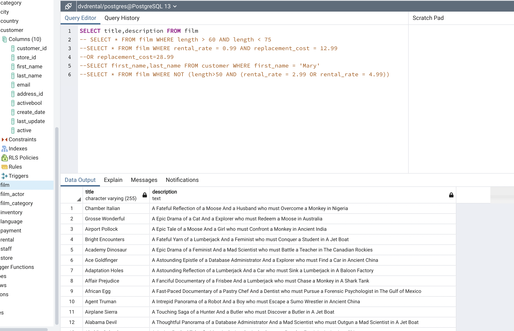
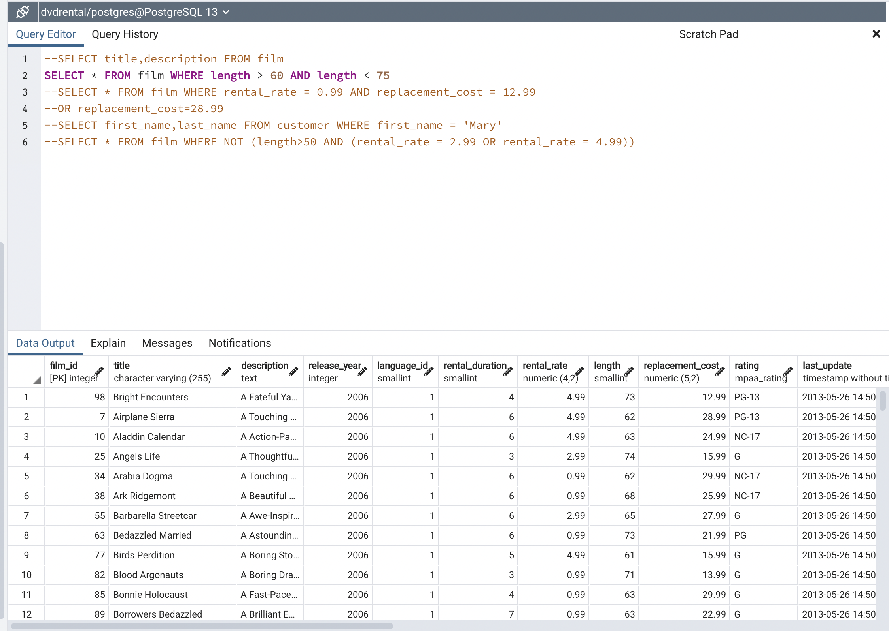
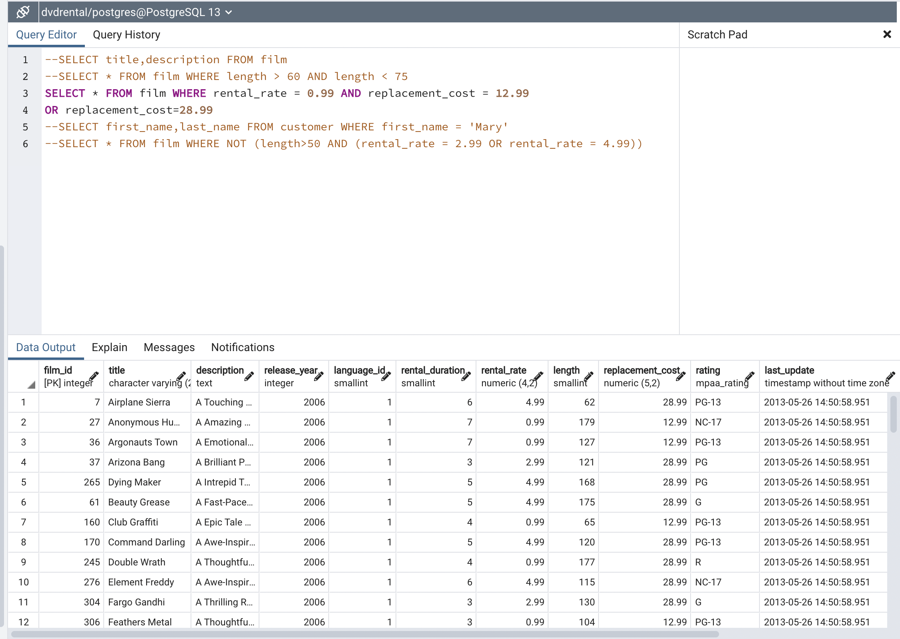
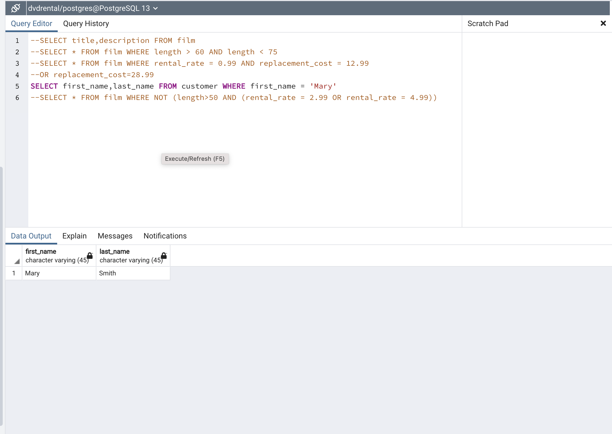
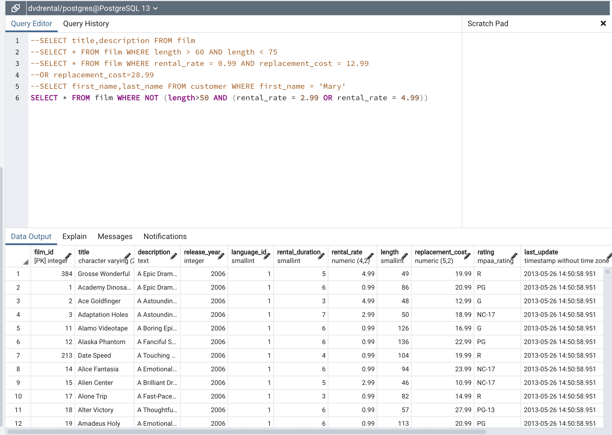

# SELECT title,description FROM film

----

# SELECT * FROM film WHERE length > 60 AND length < 75

----

# SELECT * FROM film WHERE rental_rate = 0.99 AND replacement_cost = 12.99 OR replacement_cost=28.99

----

# SELECT first_name,last_name FROM customer WHERE first_name = 'Mary'π

----

# SELECT * FROM film WHERE NOT (length>50 AND (rental_rate = 2.99 OR rental_rate = 4.99))

----